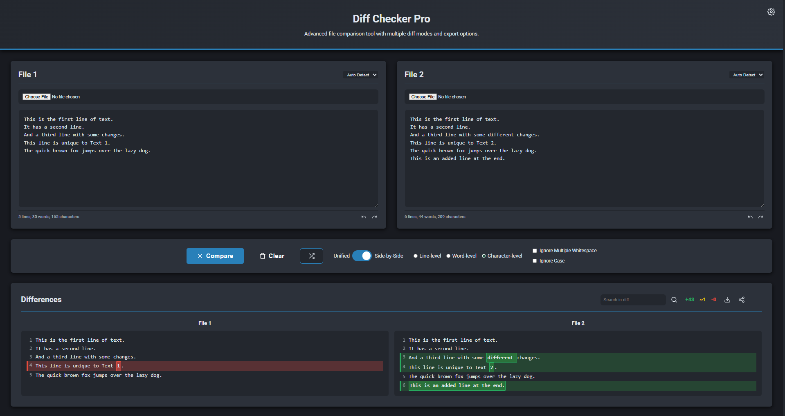

# Diff Checker Pro 🚀

A powerful, feature-rich web-based file comparison tool that makes it easy to compare files and see differences with multiple view modes, export options, and advanced features.




## ✨ Features

### 🔄 **Multiple Diff Modes**
- **Line-level comparison** - Perfect for code and structured text
- **Word-level comparison** - Great for documents and prose
- **Character-level comparison** - Precise character-by-character analysis

### 📱 **Modern Interface**
- **Responsive design** - Works perfectly on desktop, tablet, and mobile
- **Dark/Light theme** - Switch between themes with a single click
- **Syntax highlighting** - Support for JavaScript, Python, HTML, CSS, JSON, XML, and more
- **Drag & drop support** - Simply drag files to compare them instantly

### 🛠️ **Advanced Options**
- **Ignore whitespace** - Focus on content changes
- **Ignore case** - Case-insensitive comparisons
- **Auto-compare** - Automatically compare as you type
- **Undo/Redo** - Full history support for both text areas

### 🔍 **Search & Navigation**
- **Search within diffs** - Find specific changes quickly
- **Unified and side-by-side views** - Choose your preferred layout
- **Line numbers** - Easy reference and navigation
- **Keyboard shortcuts** - Boost your productivity

### 📤 **Export & Share**
- **HTML export** - Styled reports for documentation
- **Text export** - Plain text for simple sharing
- **JSON export** - Structured data for integration
- **URL sharing** - Share comparisons via links
- **Copy to clipboard** - Quick copying of results

### ⚙️ **Customization**
- **Font size adjustment** - From 12px to 20px (default: 16px)
- **Tab size control** - 2, 4, or 8 spaces (default: 4)
- **Word wrap toggle** - Better readability for long lines (default: ON)
- **Settings persistence** - Your preferences are saved
- **Show line numbers** - ON by default
- **Auto compare** - ON by default
- **Dark mode** - ON by default
- **Reset Settings button** - Instantly restore all defaults in the settings modal

## 🚀 Getting Started

### Option 1: Download and Run Locally
1. Download all files from this repository
2. Open `index.html` in your web browser
3. Start comparing files immediately!

### Option 2: Use Online
Visit the [live demo](https://sukarth.github.io/diffchecker-pro) to use it directly in your browser.

### Option 3: Clone the Repository
```bash
git clone https://github.com/sukarth/diffchecker-pro.git
cd diffchecker-pro
# Open index.html in your browser
```

## 📋 Usage

### Basic Comparison
1. **Upload files** using the file inputs or drag & drop
2. **Paste text** directly into the text areas
3. **Choose diff mode**: Line, Word, or Character level
4. **Click Compare** to see the differences
5. **Toggle between views**: Unified or Side-by-Side

### Advanced Features
- **Press `Ctrl+Enter`** to quickly compare
- **Press `Ctrl+F`** to search within results
- **Press `Ctrl+S`** to export results
- **Press `Ctrl+K`** to clear all content
- **Press `Ctrl+Z/Y`** for undo/redo in text areas
- **Diff stats** - Accurate for line, word, and character level comparisons

### File Format Support
- **Code files**: `.js`, `.ts`, `.py`, `.html`, `.css`, `.json`, `.xml`
- **Text files**: `.txt`, `.md`, `.csv`
- **Configuration**: `.yaml`, `.yml`, `.ini`
- **And many more!**

## 🎯 Use Cases

### For Developers
- **Code reviews** - Compare different versions of code files
- **Configuration changes** - See what changed in config files
- **Documentation updates** - Track changes in README files
- **Bug fixing** - Compare working vs. broken code

### For Writers & Editors
- **Document revisions** - Track changes in articles and documents
- **Content comparison** - Compare different versions of content
- **Translation work** - Compare original and translated text
- **Proofreading** - Find differences between drafts

### For Data Analysis
- **CSV comparison** - Compare data files
- **Log analysis** - Find differences in log files
- **Report changes** - Track changes in reports
- **Configuration audits** - Compare system configurations

## 🔧 Technical Details

### Browser Support
- ✅ Chrome 80+
- ✅ Firefox 75+
- ✅ Safari 13+
- ✅ Edge 80+

### Technologies Used
- **HTML5** - Semantic markup and modern features
- **CSS3** - Flexbox, Grid, Custom Properties, Animations
- **JavaScript ES6+** - Classes, Modules, Async/Await
- **diff.js** - Core diffing algorithm
- **Local Storage API** - Settings persistence
- **File API** - File reading and processing
- **Clipboard API** - Copy to clipboard functionality

### Performance
- ⚡ **Fast comparison** - Optimized algorithms handle large files
- 🔄 **Real-time updates** - Instant feedback as you type
- 💾 **Memory efficient** - Smart memory management for large diffs
- 📱 **Mobile optimized** - Smooth performance on all devices

## 🛣️ Roadmap

### Upcoming Features
- [ ] **PDF export** - Generate PDF reports
- [ ] **GitHub integration** - Compare files from repositories
- [ ] **More syntax highlighting** - Support for additional languages
- [ ] **Diff statistics** - Detailed change analytics
- [ ] **Plugin system** - Extensible architecture
- [ ] **Collaborative features** - Real-time collaboration
- [ ] **API integration** - Connect with external tools

### Improvements
- [ ] **Performance optimization** - Handle even larger files
- [ ] **Better mobile experience** - Enhanced touch interactions
- [ ] **Accessibility improvements** - Better screen reader support
- [ ] **More export formats** - XML, CSV, and others
- [ ] **Advanced search** - Regular expressions, fuzzy search

## 🤝 Contributing

We welcome contributions! Here's how you can help:

### Ways to Contribute
- 🐛 **Report bugs** - Found an issue? Let us know!
- 💡 **Suggest features** - Have an idea? We'd love to hear it!
- 🔧 **Submit PRs** - Fix bugs or add features
- 📚 **Improve docs** - Help make the documentation better
- 🎨 **Design improvements** - Make it look even better

### Development Setup
1. Fork the repository
2. Clone your fork: `git clone https://github.com/sukarth/diffchecker-pro.git`
3. Create a feature branch: `git checkout -b feature-name`
4. Make your changes
5. Test thoroughly
6. Submit a pull request

### Code Style
- Use consistent indentation (2 spaces)
- Follow JavaScript ES6+ standards
- Write descriptive commit messages
- Add comments for complex logic
- Ensure responsive design principles

## 📄 License

This project is licensed under the MIT License - see the [LICENSE](LICENSE) file for details.

## 🙏 Acknowledgments

- **diff.js** library for the core diffing algorithm
- **Feather Icons** for the beautiful icon set
- **Google Fonts** for the Roboto and Fira Code fonts
- **MDN Web Docs** for excellent web development resources

## 📊 Stats


## 🌟 Show Your Support

If you find this project helpful, please consider:
- ⭐ **Starring the repository**
- 🐦 **Sharing on social media**
- 📝 **Writing a review or blog post**
- ☕ **Buying me a coffee** (link coming soon!)

---

<div align="center">

**Made with ❤️ by [Sukarth](https://github.com/Sukarth)**

[⬆ Back to Top](#diff-checker-pro-)

</div>
